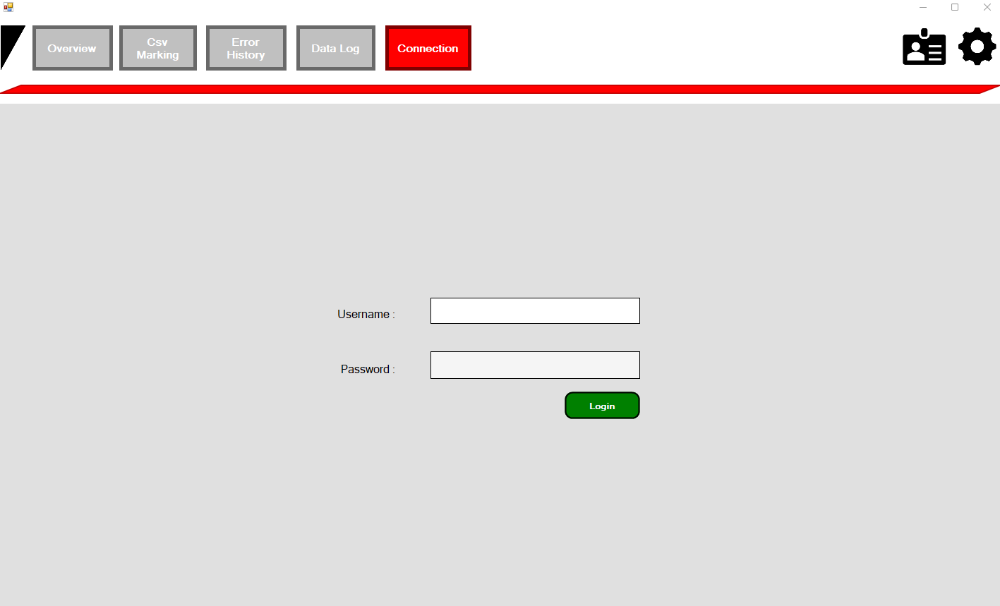
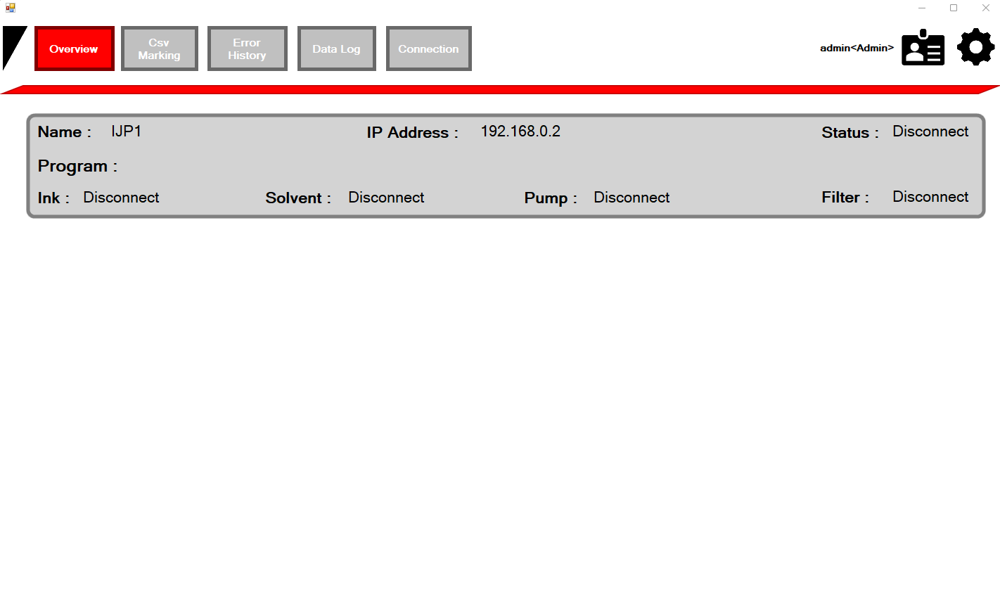
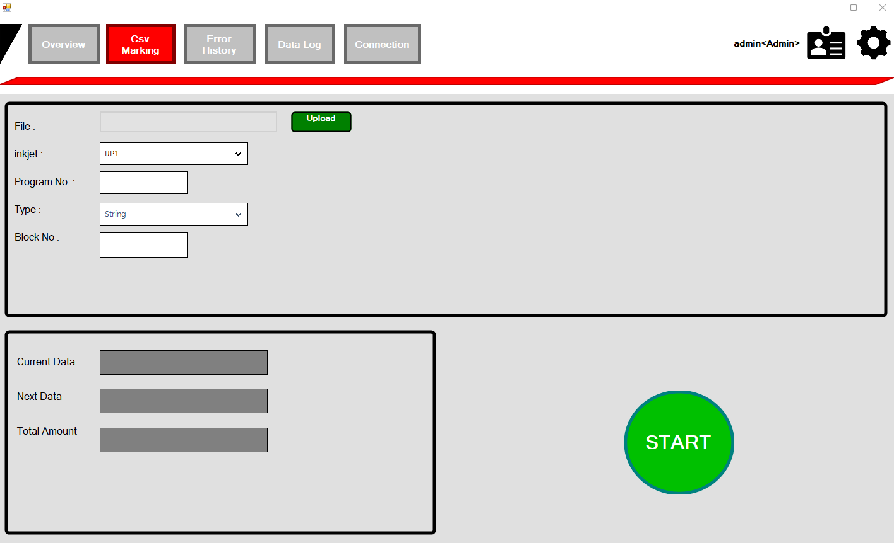
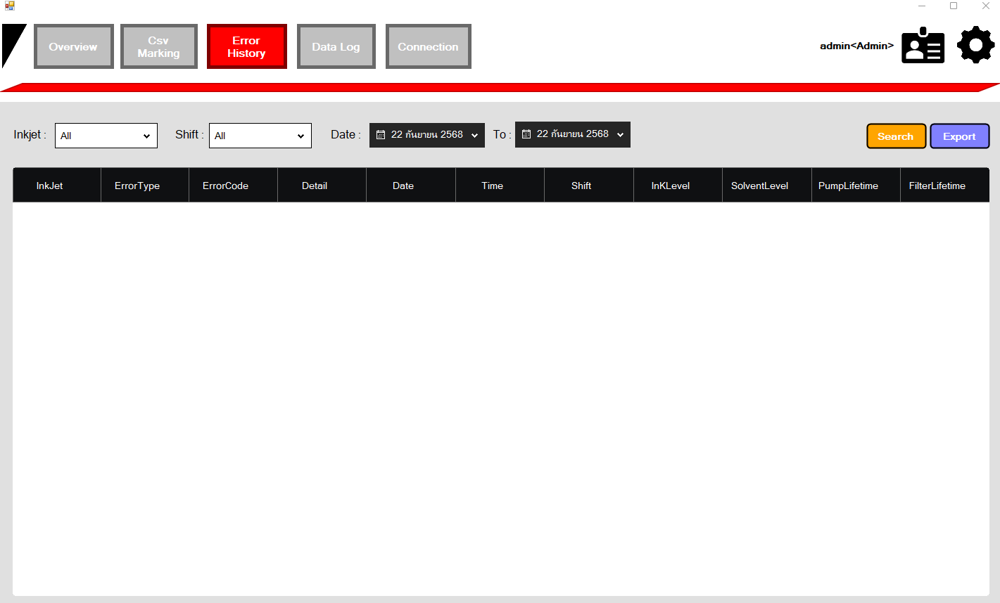
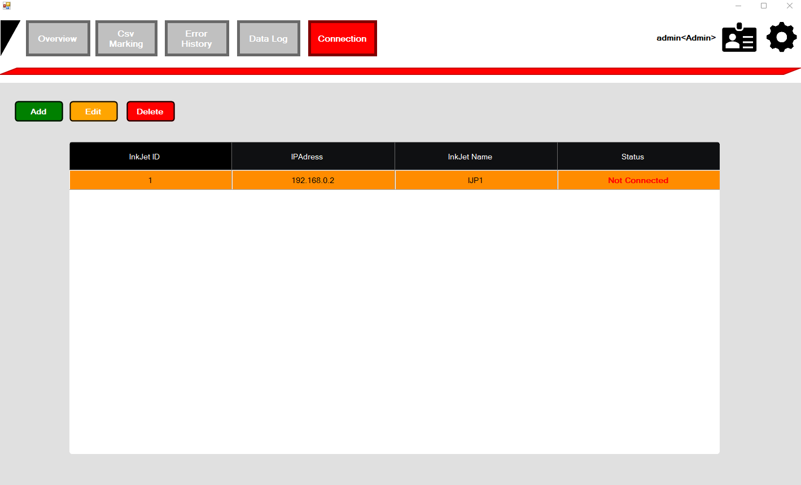

# 🚀 โปรแกรมควบคุมการส่งข้อความแบบชุด Inkjet Keyence

---

## 📖 คำอธิบาย
โปรเจกต์นี้เป็นระบบสำหรับควบคุมเครื่องพิมพ์ Inkjet Keyence MK-G1000 Series  
มีฟีเจอร์หลัก เช่น:  
- แสดงสถานะเครื่องพิมพ์ ทั้งหมด เช่น Ink, Solvent, Pump, Filter เป็นต้น
- ส่งข้อความแบบชุด (Mutiple text) โดยการ อัพโหลดไฟล์ CSV เพื่อพิมพ์ตามลําดับข้อความได้
- แสดง Log การเกิด error และ warning ของเครื่อง Inkjet ทั้งหมด เช่น ErrorCode ErrorName Detail Time Shift เป็นต้น 
- แสดง Log การยิงจํานวนข้อความ เช่น ข้อความที่ยิง จํานวนครั้ง วันที่เริ่ม วันที่สิ้นสิ้น เป็นตัน
- รายการ Log ต่างๆ สามารถ Filter ตามวันที่ได้ และ Export ไฟล์ Excel ได้

สามารถใช้งานผ่าน คอมพิวเตอร์หรือโน้ตบุ๊ก และเชื่อมต่อ Inkjet พร้อมกันได้สูงสุงได้หลายเครื่อง ผ่าน **IP Address**

---

## 📸 ตัวอย่างหน้าจอ (Screenshots)

ภาพรวมการทำงานของระบบ:

  
*รูปที่ 1: หน้า login*

  
*รูปที่ 2: หน้า Overview แสดงรายการ Inkjet ทั้งหมด*

  
*รูปที่ 3: หน้า Overview แสดงรายการ Inkjet ทั้งหมด*

  
*รูปที่ 4: หน้า CsvMarking สําหรับส่งข้อความ*

  
*รูปที่ 5: หน้า error แสดงรายการ error Inkjet*

  
*รูปที่ 6: หน้า connection แสดงรายการเชื่อมต่อ Inkjet*

---

## ⚙️ วิธีติดตั้งโปรแกรม

1. นำโฟลเดอร์ `Inkjet` ไว้บน **Desktop**  
2. เข้าไปที่ `Inkjet -> setup`  
3. คลิกโปรแกรม `inkjet.exe` เพื่อทำการติดตั้ง  

---

---

## 🖥️ เครื่องมือที่ใช้ในการพัฒนา

1. ระบบปฏิบัติการ Windows 10  
2. Microsoft Visual Studio 2022
  - Guna.UI2.WinForms 2.0.4.7  
  - Newtonsoft.Json 13.0.3  
3. .NET Framework 4.7.2  
